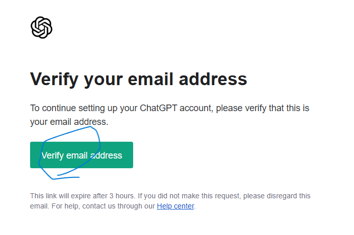

# ChatGPTのセットアップ

※ ChatGPTのアカウントを持っていない方のためのセットアップ・ガイドです。すでにChatGPTを利用している方は、この手順をスキップし次の項目に進んで下さい。

## 1. サインアップとメール確認

1. [ChatGPTのサイト](https://chatgpt.com/)にアクセスし、「Sign up」をクリックします。

   

2. メールアドレスを入力します。 (GoogleやMicrosoftのアカウントを持っている人は、画面下段のボタンを押してもOK, この後の手順を省略できます。ここでは説明のために、あえてGmailでもテキストで入力しています。)

3. パスワードを決めます (忘れないように控えておいてください) 。
   

4. メールアドレスを確認するために、Open Gmailをクリックします (これが表示されない場合、そのまま普段メールを受け取っているアプリなどを開いてください)。

   

5. OpenAI社 (ChatGPTの開発元) から届いたメール内にある「Verify email address」ボタンをクリックしてください (スマホからでもOK)。

   

6. 確認が完了すると、以下のような画面が表示されます。

   

## 2. ログインと日本語化

1. ChatGPTのサイトを改めて開き、「Log in」をクリックします。

   

2. メールアドレス、パスワードを入れます。

   
   

3. ログインしたら、プロフィールアイコンをクリックします。

4. 「Settings」を選択してください。

   

5. 「Settings」の中の「Language」をクリックします。
   

6. 「日本語」を選択します。

   

7. 以下のように表示されていれば、準備は完了です。

   

## うまくいかない時は？

うまく進まない時には、ネット検索でChatGPTのセットアップの仕方を検索してみて下さい。他にも、友達や先生ですでにChatGPTを使っている人がいれば、聞いてみるのも良い方法です。それでもうまくいかない時には、ワークショップ当日にスタッフがセットアップをお手伝いします。
