# Visual Studio CodeとPythonのセットアップ手順

## A. VSCodeのインストールと日本語化

### 1. Visual Studio Code (VSCode) のインストール

1. [VSCode のダウンロードページ](https://code.visualstudio.com/)にアクセスします。
   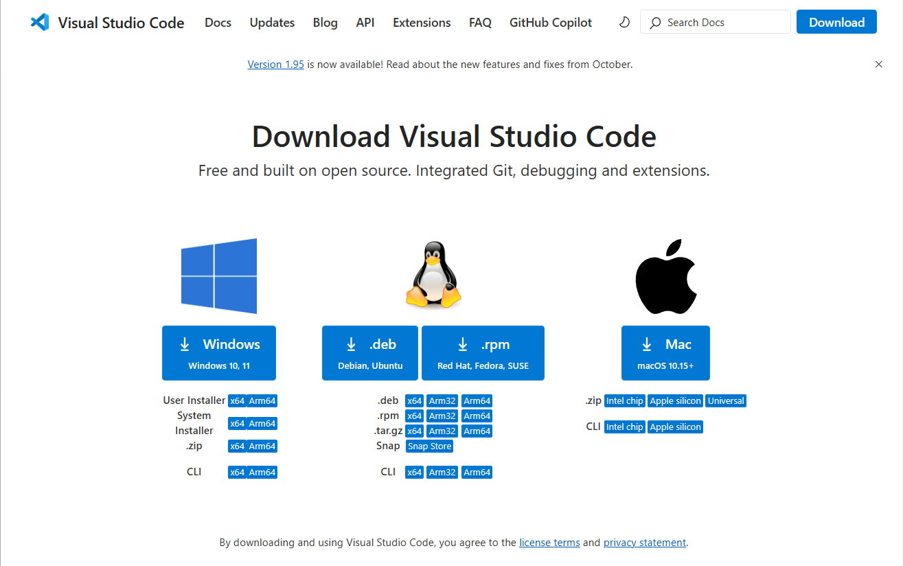

2. "Download for Windows"（もしくは使用している OS に対応するボタン）をクリックし、インストーラをダウンロードします。

3. ダウンロードしたインストーラを実行し、指示に従ってインストールを進めます。

   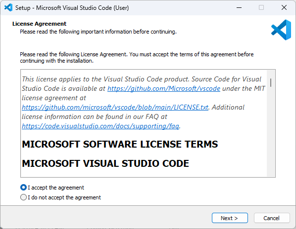

   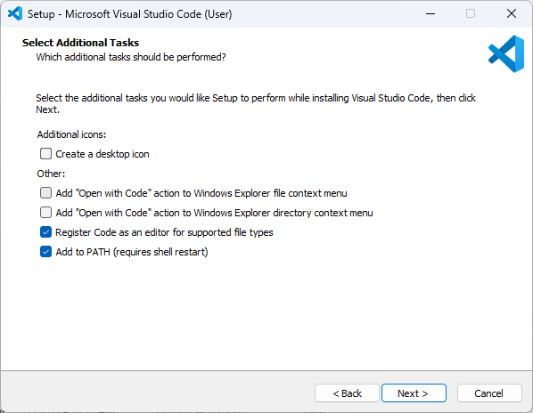

   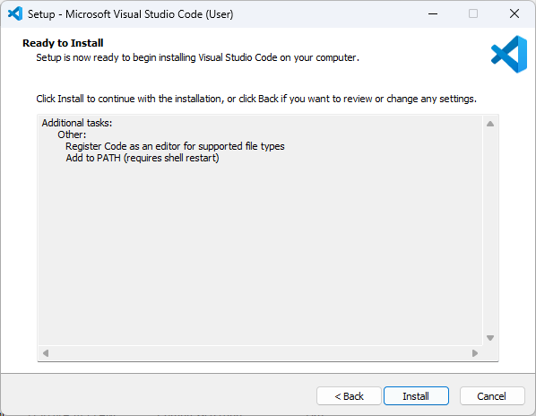

4. インストールが完了したら、VSCode を起動します。

### 2. VSCode のユーザーインターフェースを日本語化

1. VSCode を起動したら、左側の拡張機能アイコン（四角形が組み合わさったようなマーク）をクリックします。

   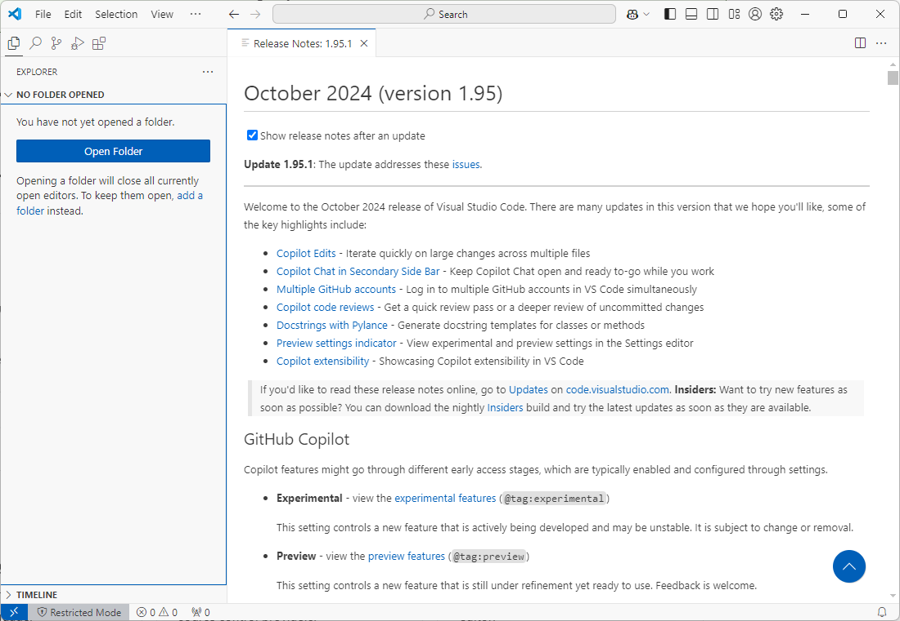

2. 検索ボックスに「Japanese Language Pack」と入力し、Microsoft の **Japanese Language Pack for Visual Studio Code** をインストールします。

   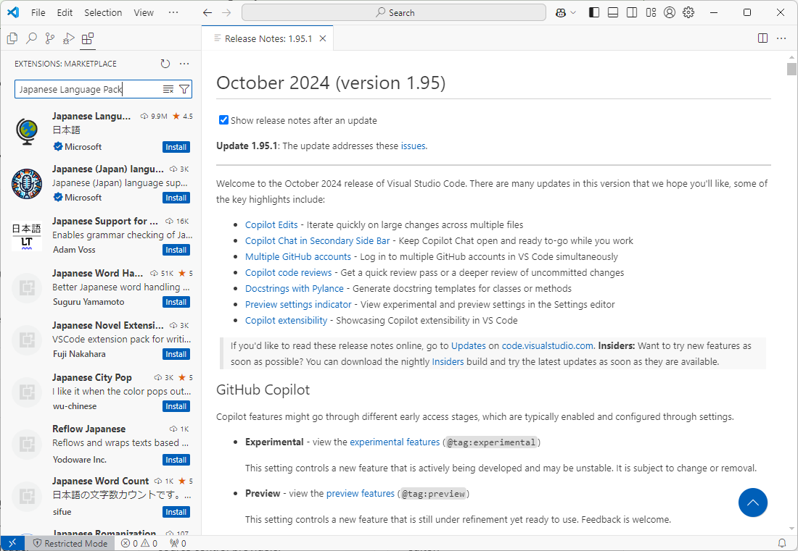

3. "Change Language and Restart"をクリックして、言語を日本語に切り替えます。インストールが完了すると、VSCode のインターフェースが日本語に変更されます。

   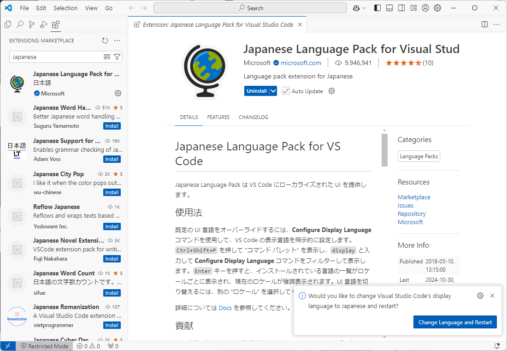

## B. Pythonインストール + VSCode連携の設定

### 1. Python のインストール

1. [Python の公式サイト](https://www.python.org/downloads/)にアクセスします。

   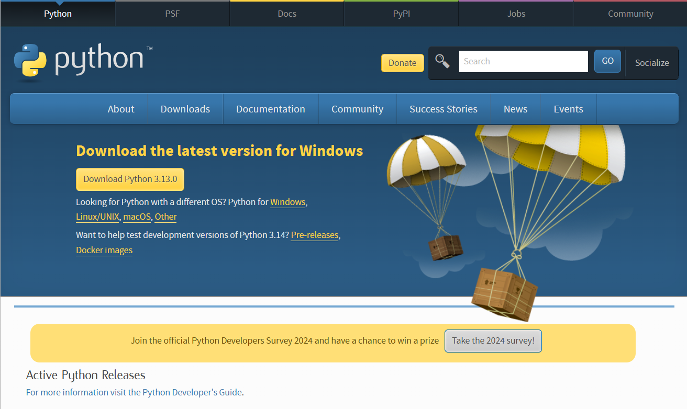

2. "Download Python" ボタンをクリックして最新バージョンをダウンロードします。

3. インストーラを実行し、"Add Python to PATH" にチェックを入れてから "Install Now" をクリックします。

   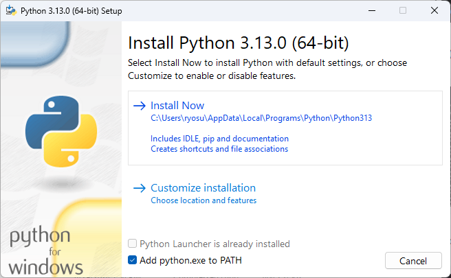

4. インストールが完了したら、Macの場合は「ターミナル」アプリ、Windowsの場合は"PowerShell"を立ち上げて、 "python --version" と入力してエンターキーを押します。3.13 のようなバージョン番号が表示されていれば、インストールは成功です。

### 2. VSCode で Python 環境の設定

1. VSCode を起動したら、左側の拡張機能アイコン（四角形が組み合わさったようなマーク）をクリックします。

2. 検索ボックスに「Python」と入力し、Microsoft の **Python 拡張機能** をインストールします。

   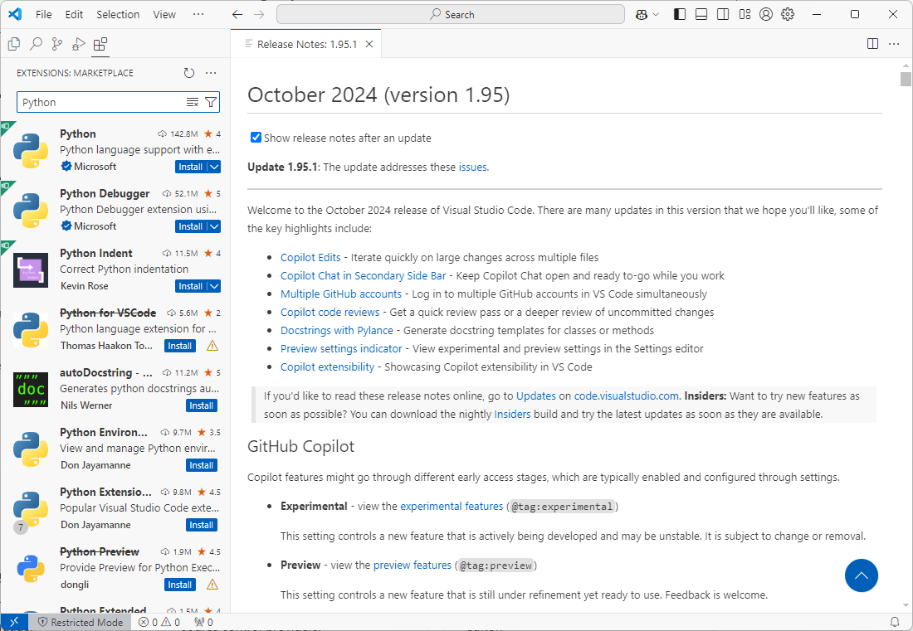

# C. 動作確認

### 1. 簡単な Python スクリプトの実行

1. VSCode で「新しいファイル」をメニューから選びます。

   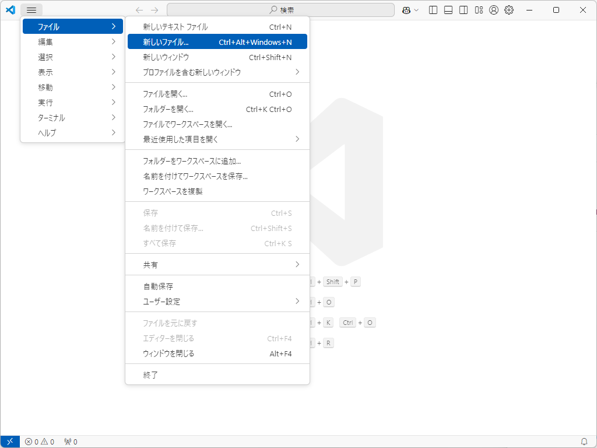

2. ファイルの種類として「Pythonファイル」を選択します。

   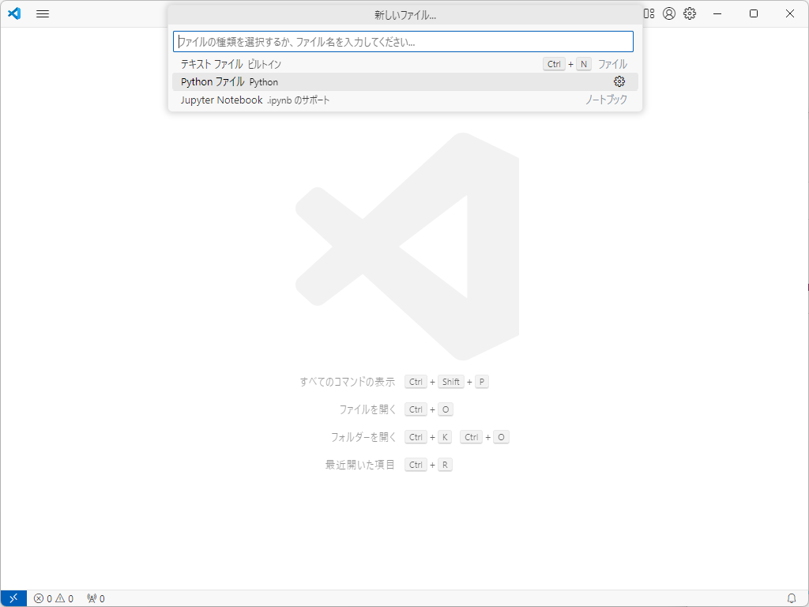

3. 以下のコードを入力します：

   ```python
   print("こんにちは!")
   ```

   

   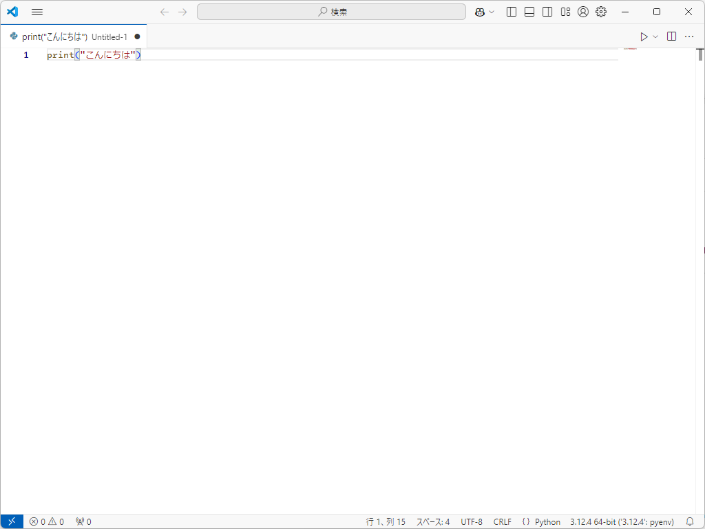

4. ファイルを保存します (場所はどこでも大丈夫ですが、デスクトップなどわかりやすい場所がおすすめです)。

   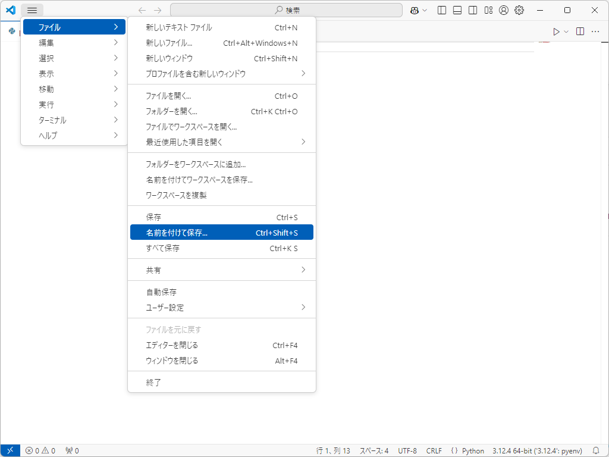

5. 右上の再生ボタンをクリックしてコードを実行します。

   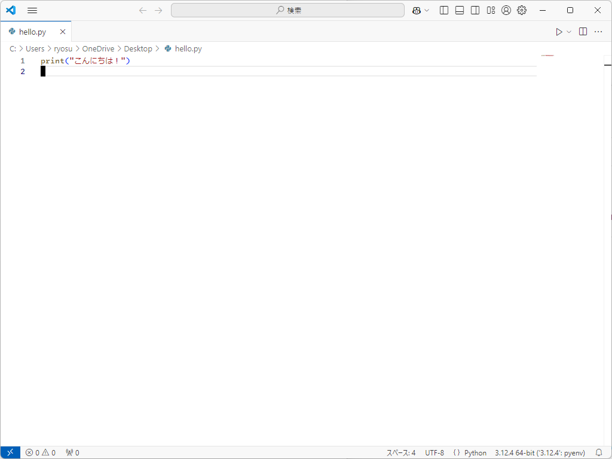

6. 実行結果のウィンドウに「こんにちは!」と表示されることを確認します。

   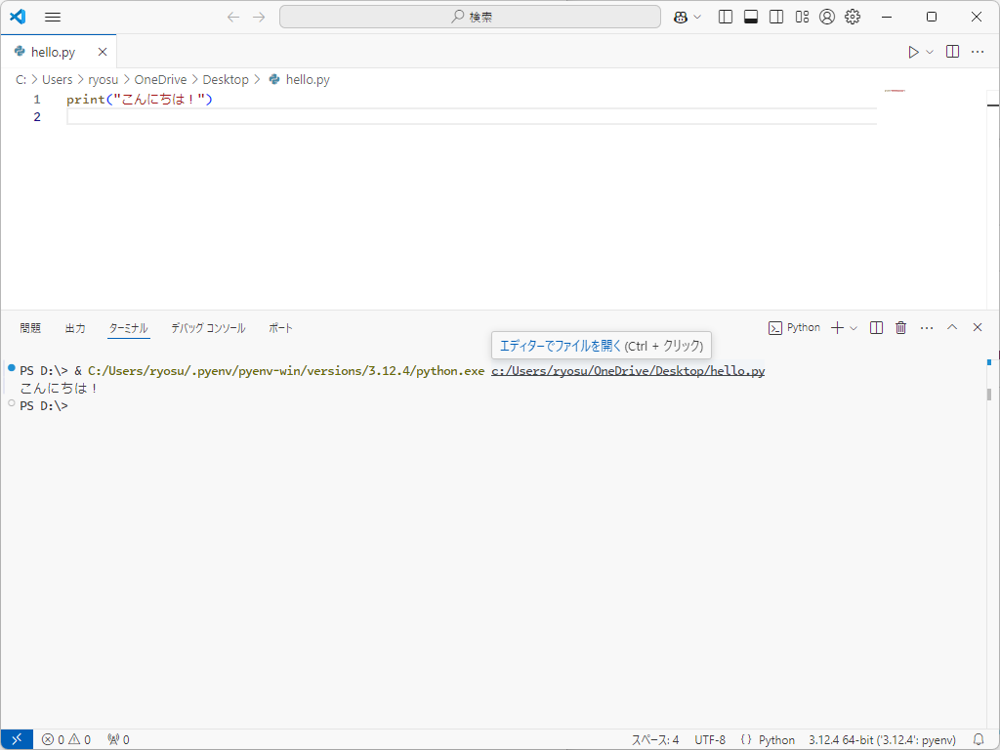

### 2. トラブルシューティング

- Python が見つからないと表示された場合、Python のインストールパスが正しく設定されていることを確認してください。
- VSCode のターミナルが動作しない場合、拡張機能が正しくインストールされているか確認してください。

### 3. おすすめの追加拡張機能

- **Pylance**: 途中まで書くと、残りを補完してくれる拡張機能。
- **Pylint**: 間違いがないか、自動でチェックしてくれる拡張機能。
