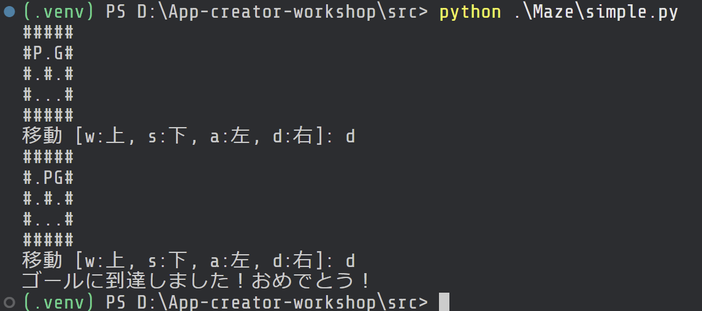
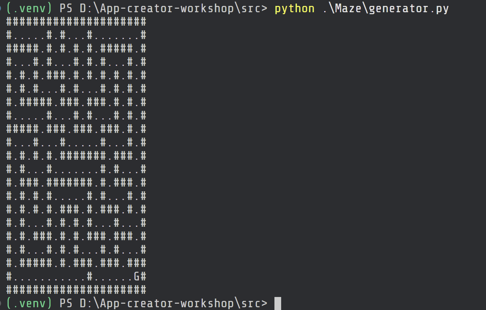
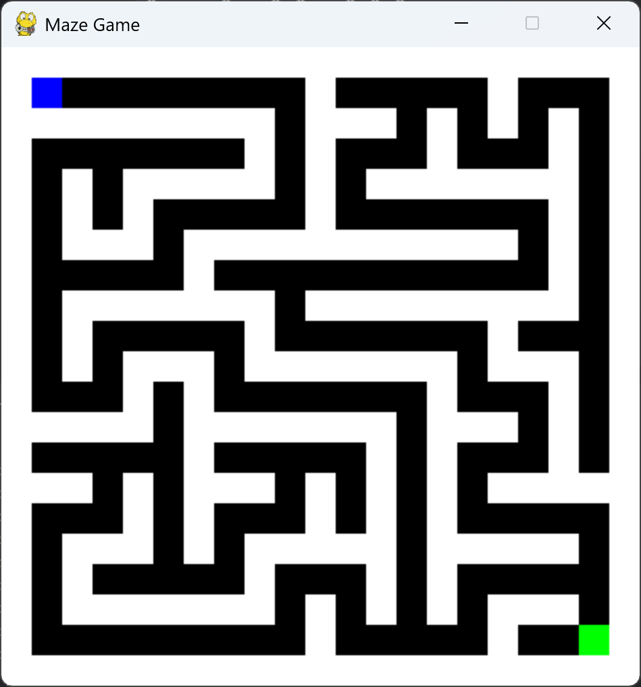
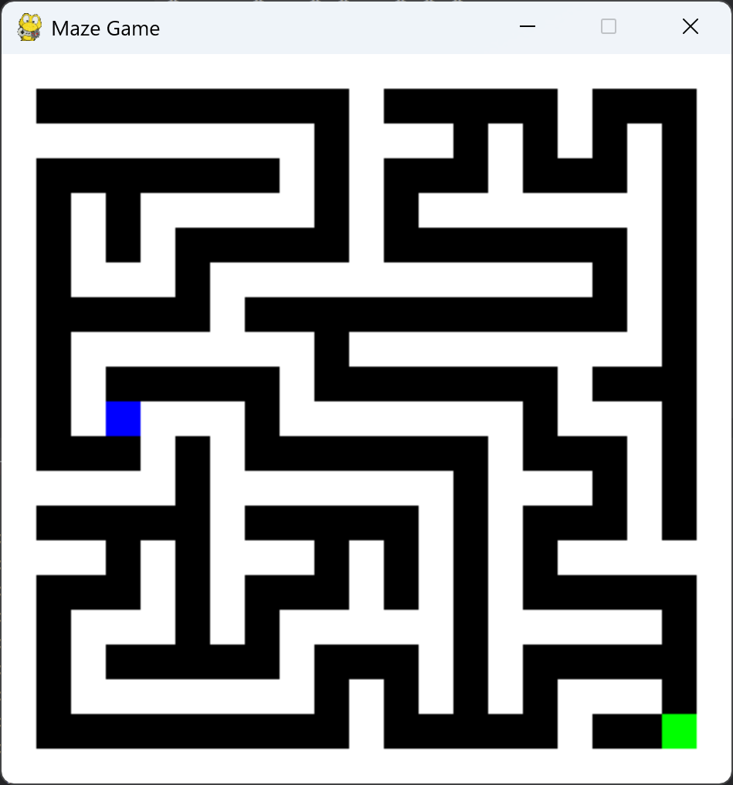
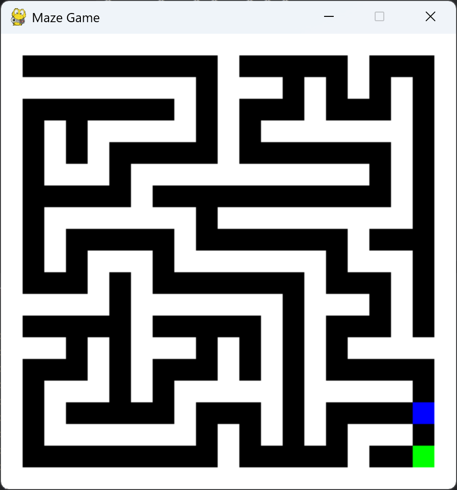

# 実行方法

## 初期コードの実行

1. 自分の使いやすいコーディング用フォルダを決める
    (以下例はどちらも `ダウンロード` や `書類` と同じ並びのフォルダ)

   - Windowsの例: `C:\Users\<自分のユーザー名>\Code` など
   - Macの例 `/home/<自分のユーザー名>/Code` など

2. コーディング用フォルダに、プロジェクト用のフォルダを作る

   - Windowsの例: `C:\Users\<自分のユーザー名>\Code\Maze` など
   - Macの例 `/home/<自分のユーザー名>/Code\Maze` など

3. Visual Studio Codeで「フォルダを開く」を選択し、プロジェクト用フォルダを開く

4. 生成AIからの「完全版コード」を `simple.py` という名前で、プロジェクト用フォルダに保存

5. PowerShell (Windows) または Terminal (Mac) を開き、以下を実行
   (改行が入っているところでエンターキーを押して、一行ずつ実行します)
   **Windows**

   ```powershell
   cd C:\Users\<自分のユーザー名>\Code\Maze
   python simple.py
   ```

   **Mac**

   ```bash
   /home/<自分のユーザー名>/Code/Maze
   python simple.py
   ```

6. P (プレイヤー) の文字をG (ゴール) まで (`w`キーで上, `s`キーで下, `a`キーで左, `d`キーで右へ一文字ずつ) 移動させればクリア

### 実行の様子


## 迷路の複雑化

1. 生成AIが作った「迷路生成プログラム」を自分の決めたプロジェクト用フォルダ (先ほどの `maze.py` と同じ場所) に`maze_generator.py` を作成し、全文をペーストする

2. プログラムを実行して、迷路が作成されることを確認する
   ( 先ほどからの続きでやっていたら、1行目の `cd` から始まるコマンドの実行は必ずしも必要ありません )
   **Windows**
   ```powershell
   cd C:\Users\<自分のユーザー名>\Code\Maze 
   python generator.py
   ```
   **Mac**
   ```bash
   /home/<自分のユーザー名>/Code/Maze
   python generator.py
   ```

### 実行の様子


## ゲームアプリ化

1. `pygame` というツールをPythonから使うためのフォルダ `.venv` を作成します
   ( 先ほどからの続きでやっていたら、こちらも同様に、1行目の `cd` から始まるコマンドの実行は必ずしも必要ありません )
   **Windows**
   ```powershell
   cd C:\Users\<自分のユーザー名>\Code\Maze
   python -m venv .venv
   ```
   **Mac**
   ```bash
   cd /home/<自分のユーザー名>/Code/Maze
   python -m venv .venv
   ```
2. `pygame` をPythonから使えるようにインストールします
   **Windows**
   ```powershell
   .venv\Scripts\activate
   pip install pygame
   ```
   **Mac**
   ```bash
   source .venv/bin/activate
   pip install pygame
   ```
3. 生成AIが作った「pygame バージョンコード」を ``__main__.py`` という名前で、プロジェクト用フォルダに保存します
4. 以下のコマンドでプログラムを実行します
   **Windows**
   ```powershell
   cd C:\Users\<自分のユーザー名>\Code\Maze
   python __main__.py
   ```
   **Mac**
   ```bash
   /home/<自分のユーザー名>/Code/Maze
   python __main__.py
   ```
5. (補足) MazeはPythonモジュールになっているので、以下のようなコマンドで呼び出すこともできます
   **Windows**
   ```powershell
   cd C:\Users\<自分のユーザー名>\Code
   python -m Maze

   **Mac**
   ```bash
   /home/<自分のユーザー名>/Code
   python -m Maze
   `
### 実行の様子



